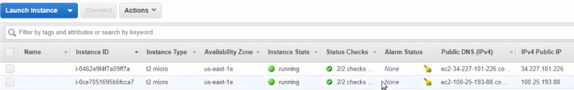
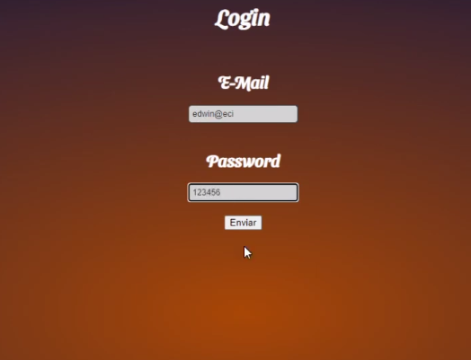
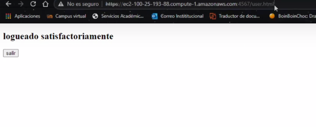
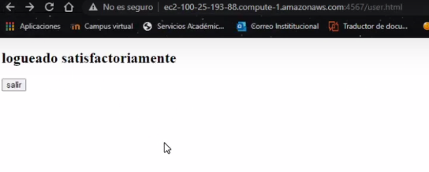
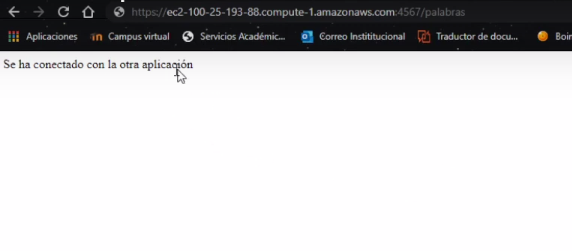

# AREP-security-app

## Resumen

El objetivo de este laboratorio es lograr una aplicación que permita acceder de manera segura desde el browser, ademas de poder garantizar una autenticación de usuarios con las credenciales correspondientes para poder acceder a los recursos de dicho usuario.

## Descarga e instalación

Para clonar este repositorio basta con copiar la siguiente linea en un Shell de cualquier sistema operativo

```
git clone https://github.com/Edyesid/AREP-taller-01.git
```

Es recomendable tener instalado maven en su computadora para poder visualizar de una mejor manera las pruebas y compilación del taller. para esto dirijase al pagina de maven y siga los pasos de instalación.

```
https://maven.apache.org/install.html
```

Una vez que tenga maven en su computadora, puede dirigierse a la carpeta raiz de cada repositorio (AREP-Client-securityapp, AREP-security-app-login) y ejecutar los siguientes comando para poder ejecutarlos.

```
mvn package
```

```
mvn exec:java -Dexec.mainClass="edu.escuelaing.arep.app.App
```


para acceder al servicio web puede acceder con el siguiente enlace 

```
https://localhost:4567/
```


## Service  [](https://circleci.com/gh/Edyesid/AREP-Client-securityapp)

[aquí](https://github.com/Edyesid/AREP-Client-securityapp.git)

## Service Login  [](https://circleci.com/gh/Edyesid/AREP-security-app-login)

[aquí](https://github.com/Edyesid/AREP-security-app-login.git)

## Pruebas

A continuación se muestra los servicios creados y como funcionan


Para cada servicio se desplego una maquina en aws mediante el uso de ec2



Se creo una pagina de login la cual pide un usuario y contraseña



Si se ingresa un usuario autenticado, se podra redirigir a esta pagina donde dice "logueado satisfactoriamente" junto con un boton de salir de la sesión



cuando se esta logueado se puede verificar, haciendo un get mediante la direccion /islogin



para probar la conección con el otro servicio se tiene que dirigir a la ruta /palabras




## video

[video](https://youtu.be/f9rC75hFceY)

## Autor

Edwin Yesid Rodriguez Maldonado

## Licencia

Este laboratorio esta bajo la licencia de GNU GENERAL PUBLIC LICENSE
